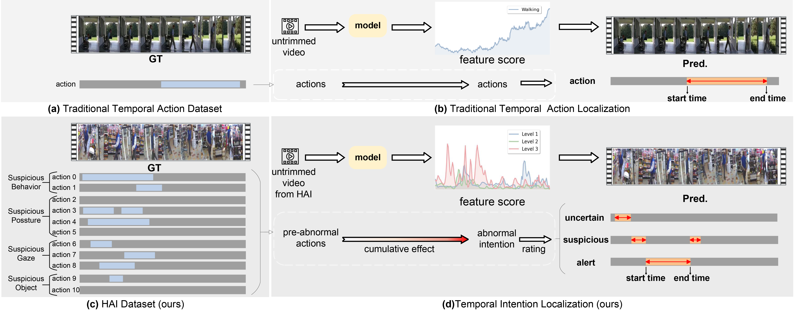
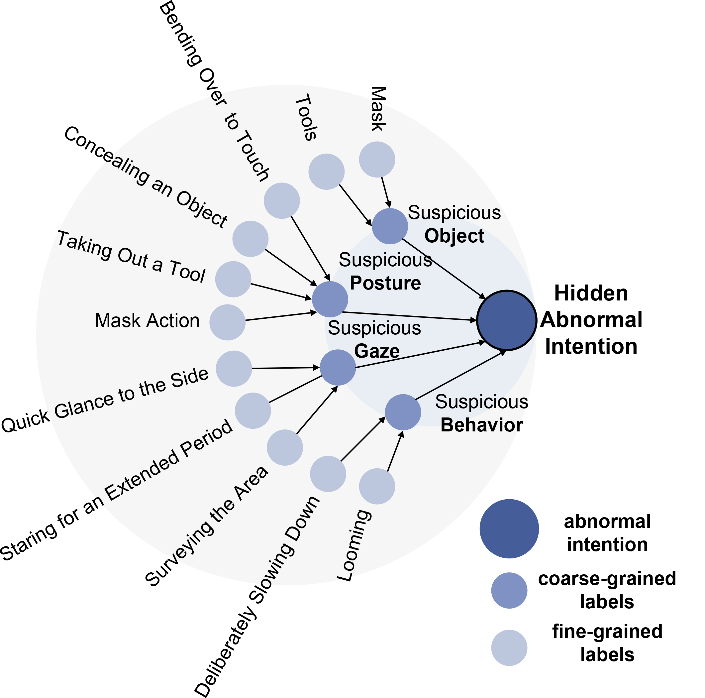

# Predicting the Unseen: A Novel Dataset for Hidden Intention Localization in Pre-abnormal Analysis

<p style="font-size: 1.5em; font-weight: bold;">
  <a href="https://pan.baidu.com/s/1B8Ngg0LGWeeBCrEcE7QoRg?pwd=8slw">Dataset Videos</a> | <a href="https://dl.acm.org/doi/10.1145/3664647.3681113">Paper</a>
</p>

**[Predicting the Unseen: A Novel Dataset for Hidden Intention Localization in Pre-abnormal Analysis](https://dl.acm.org/doi/pdf/10.1145/3664647.3681113)**  
**ZeHao Qi, Ruixu Zhang, Xinyi Hu, Wenxuan Liu, Zheng Wang**  
**AIM Lab, Wuhan University**  


## **Updates**
- **07/2024**: Our paper "*Predicting the Unseen: A Novel Dataset for Hidden Intention Localization in Pre-abnormal Analysis*" has been accepted as an Oral Paper at ACM 2024!
- **11/2024**: You can now download the **HAI Dataset Videos** [here](https://pan.baidu.com/s/1B8Ngg0LGWeeBCrEcE7QoRg?pwd=8slw).
- **11/2024**: The **HAI Dataset Annotations** are available for download [here](https://1drv.ms/u/c/cc512d5e61dad4e5/Eeyh1N2DUhdAn_0QzIntIUcBCpW0bHW3m-wuDXJ6PuqSCg?e=bre2nE).
- **11/2024**: Features of the **HAI Dataset** can be accessed via the following links:
  - [VideoMaeV2 (Baidu)](https://pan.baidu.com/s/1QDsAOGoXRSTMH4NZyMZDCw?pwd=bgbi) | [VideoMaeV2 (OneDrive)](https://1drv.ms/u/c/cc512d5e61dad4e5/ETbP2ihl26JLhNja3mga0jcBQwONci-6hC6wH1_7im6HGw?e=0McIFc)
  - [I3D-rgb+flow (Baidu)](https://pan.baidu.com/s/1AfhGRFTBCZYsESn96IwsFg?pwd=porg) | [I3D-rgb+flow (OneDrive)](https://1drv.ms/u/c/cc512d5e61dad4e5/EaLb2C7lyMJNktVV80YbXPQBbmnNa7eVdixne5l-6UwyCA?e=xjpCvk)
  - [I3D-rgb (Baidu)](https://pan.baidu.com/s/1iyFTkOYOvk1HAWDWmKEsIQ?pwd=grmv) | [I3D-rgb (OneDrive)](https://1drv.ms/u/c/cc512d5e61dad4e5/EdNecZMnW1ZIllzhIX67WjYBvG8BCltj35fK_QEVm3RR1w?e=yfYQ65)
  - [I3D-flow (Baidu)](https://pan.baidu.com/s/14EFe4IQpQ2Knd3b_F7UsCg?pwd=o4ej) | [I3D-flow (OneDrive)](https://1drv.ms/u/c/cc512d5e61dad4e5/EdfyxiXlerRJhF0AvdujltkBYxjBa_1D_C5XIeXmQaKMzg?e=0ip7PH)

- **11/2024**: The email address of the author, Zehao Qi, has been updated to: [2021300004006@whu.edu.cn](mailto:2021300004006@whu.edu.cn).

## **Dataset Hierarchy**
  
The abnormal intention is dissected into four coarse-grained dimensions, under which eleven detailed perspectives are distinguished.

## **Citation**
If you use this dataset or paper in your research, please cite it as follows:

```bibtex
@inproceedings{qi2024predicting,
  title={Predicting the Unseen: A Novel Dataset for Hidden Intention Localization in Pre-abnormal Analysis},
  author={Qi, Zehao and Zhang, Ruixu and Hu, Xinyi and Liu, Wenxuan and Wang, Zheng},
  booktitle={Proceedings of the ACM International Conference on Multimedia (ACM MM)},
  year={2024}
}
